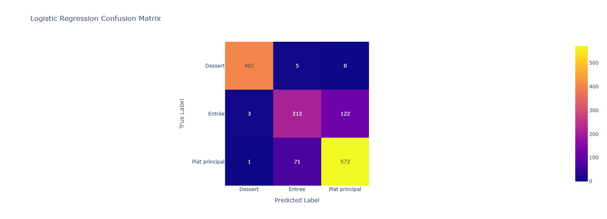
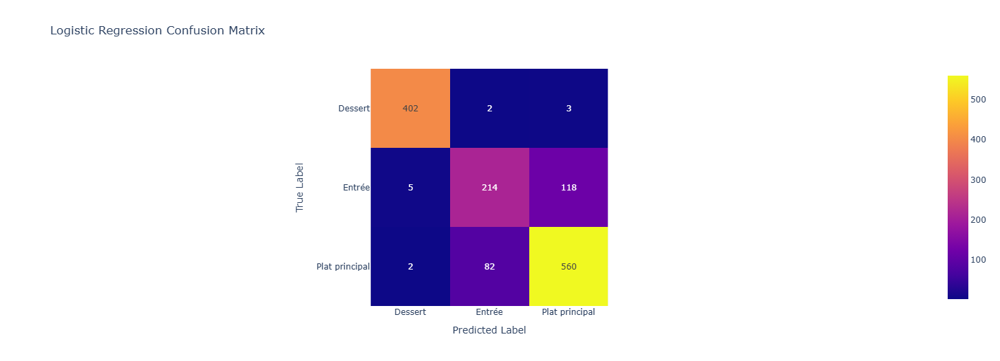

# DEFT2013 Tâche 2 :

*Bourdere Andreou Nathan - Chupin Yannis*

Retrouvez le notebook au coeur de notre projet sur ce [lien](https://colab.research.google.com/drive/1MnukWfxglrTBuqy65Yd3l0IRLzC3CvEb#scrollTo=lfnRacezr8cU).

## Description de la tâche

Les documents ont été fournis dans deux CSVs. Une ligne désignait un document et pour chaque nous disposons des informations suivantes : 

```
doc_id,titre,type,difficulte,cout,ingredients,recette
```

Prennons l'exemple du premier document situé dans le *train.csv*:

```SQL
recette_221358.xml,
"Feuilleté de saumon et de poireau, sauce aux crevettes",
Plat principal,
Facile,
Moyen,
"- 1 gros pavé de saumon - 100 g de crevettes décortiquées - 2 poireaux moyens - 1 oignon  - 1 pâte feuilletée - 25 cl de crème liquide épaisse - Un peu de vin blanc - 1/2 citron jaune - 1 jaune d'oeuf - Un peu d'huile d'olive  - Une noisette de beurre - Sel, aneth",
"Couper finement le blanc et un peu de vert des poireaux en rondelle. Éplucher et couper l'oignon. Faire chauffer l'huile d'olive et le beurre dans une poêle. Y faire revenir à feu doux les poireaux et l'oignon environ 15 minutes. En fin de cuisson ajouter le vin blanc, un peu d'aneth et du sel. Pendant ce temps faire cuire le saumon dans une poêle huilée. En fin de cuisson le faire griller sur feu vif. Préparer la sauce : mélanger les crevettes, le 1/2 citron jaune, la crème, le sel et l'aneth. Ajouter un peu de sauce à la préparation des poireaux. Préchauffer le four à 200°C (thermostat 6-7.Étaler la pâte feuilletée et la couper en 2. Sur une moitié disposer la préparation au poireaux. Disposer le saumon sur les poireaux. Y verser un peu de sauce sur le dessus (garder le reste de sauce au frigo). Refermer le chausson à l'aide de l'autre moitié de la pâte feuilleté. Bien appuyer sur les bords. Étaler le jaune d’œuf sur le dessus à l'aide d'un pinceau. Enfourner environ 20 minutes. Avant de servir chauffer la sauce et la servir à côté du feuilleté.On peut servir ce feuilleté avec une salade verte."
```

On remarque que le *doc_id* nous permet déjà d'identifier le document (la recette) de manière unique. Ensuite, notre objectif est de classifier des recettes de manière à savoir si c'est **une entrée**, un **plat principal** ou **un dessert**. Le *type* est donc l'information cruciale, l'attribut $y$, que nous devons séparer du reste des attributs pour l'entrainement.

Pour ce qui est du classifieur, les informations pertinentes à son entraînement se trouvent dans **titre**, **ingrédient** et **recette**. Ces informations peuvent être mise en valeur par l'usage d'outils TAL, d'où l'interêt particulier que nous leur portons pour ce projet. 

Cencernant le reste des attributs (*coût* et *difficulté*) nous n'y avons accodré que peu d'importance car ce que nous souhaitions avant tout c'était de perfectionner notre maîtrise des outils TAL. Notons cependant qu'il serait intéressant de les encoder via des one-hot afin de regarder si leur incormoration au modèle le fait gagner en performances. 

```SQL
recette_84191.xml,
Roulé à la confiture de lait,
Dessert,
Moyennement difficile,Bon marché,
"- Pour la garniture: - 1 boîte de lait concentré sucré de 40 cl - 250 g de mascarpone - Pour le biscuit: - 4 oeufs - 50 g de farine - 50 g de fleur de maïs - 125 g de sucre",
"La veille, préparer de la confiture de lait en portant à ébullition au bain marie pendant 3 heures le lait concentré sucré. Mélanger énergiquement les 4 jaunes d'oeufs avec le sucre, la farine, la fécule. Monter les blancs en neige et les incorporer à la préparation précédente. Répandre le tout sur une plaque de cuisson(penser au démoulage facile : silicone, papier cuisson...)et faire cuire juste 15 minutes à 180°C (thermostat 6). A la sortie du four, le rouler sur lui-même dans un linge humide. Mélanger la confiture de lait avec le mascarpone jusqu'à l'obtention d'une pâte lisse. Étaler la crème obtenue sur le biscuit en veillant à ne pas aller jusqu'aux bords puis le rouler à nouveau. Mettre au moins 1 heure au réfrigérateur. Attention aux divers temps de repos/préparation ! Chocolat chaud"
```
Ce second exemple de recette est issu quand à lui de *test.csv*. Cet ensemble de recettes permettra de *valider* nos résultats une fois les classifieurs entraînés. On remarque que format de cet ensemble est le mème que pour l'ensemble précédent. 

## Statistiques corpus
 
### Le corpus, globalement

Le set contient *13861* recettes dont *9981* sont utilisées pour le train, *2495* pour la validation et *1388* pour le test. 
Afin d'analyser le contenu de ces recettes, nous avons **concaténé** le titre, la recette et les ingrédients. 

### Distribution des types de recettes

Dans le set d'entrainement, on peut compter $5802$ Plats principaux $3762$ Desserts et $2909$ Entrées. Respectivements ils représentent $46,52\%$, $30,16\%$ et $23,32\%$ des effectifs totaux de l'ensemble d'entraînement. On remarque alors tout de suite que les *Plats principaux* sont surreprésentés, tandis que les *Entrées* sont sous représentées. Dans ce type de cironstances, on remarque assez vite que le risque pour le modèle est de répondre trop souvent *Plat principal* dans le but d'améliorer l'accuracy globale, au détriment du tax de vrai positifs pour les Entrées. 

Le set de test quant à lui compte 644 Plats principaux, 407 Desserts et  2909 Entrées. Respectivements ils représentent $16,26\%$, $10,27\%$ et $73,45\%$ des effectifs totaux de l'ensemble de test. On remarque une encore plus grande surreprésentation de Entrées cette fois-ci. 

## Méthodes proposées

En ce qui concerne les méthodes utilisées, nous avons testé à la fois plusieurs *classifieurs* mais aussi plusieurs utilisations des données à notre disposition. 

### Run1: Méthode Aléatoire, notre base

	Description de la méthode:
	- Aucun descripteur utilisé.
	- Associer à une recette un label aléatoire, de manière équiprobable. 

Toutes les méthodes qui suivent, ont été testées avec les classifieurs suivant : 
 - **SVC**
 - **Gaussian NB**
 - **Rondom Forest**
 - **Logistical regression**

### Run2:TF-IDF
	Description de la méthode :
	- Le titre, les ingrédients et la recette ont été concaténés et transformés en vecteurs selon la méthode TF-IDF
	- Les 4 classifieurs sus-mentionés sont testés
  
### Run3: Word2vec
	Description de la méthode :
	- Le titre, les ingrédients et la recette ont été concaténés et vectorisés à l'aide du modèle d'embedings word2vec.
	- Les 4 classifieurs sus-mentionés sont testés
  
### Run4: Camembert
	Description de la méthode :
	- Le titre, les ingrédients et la recette ont été concaténés et vectorisés à l'aide du modèle d'embedings Camebmebert qui est un modèle BERT fien-tuné pour le français.
	- Les 4 classifieurs sus-mentionés sont testés

## Résultats

### Les f1 Scores en Validation

f1-score pour la **baseline** : 0.33

| Run       |    SVC   |Gaussian Nb| Rand. Forest | Reg. Log. |
| --------- | --------:| ---------:| ------------:| ---------:|
| baseline  |     /    |      /    |       /      |      /    |
| TF-IDF    | **0.86** |      0.59 |         0.77 |  **0.86** |
| Word2vec  |     0.83 |      0.79 |         0.80 |      0.83 |
| Camembert |     0.85 |      0.79 |         0.79 |      0.84 |

On remarque que SVC et Regression logistique se démarquent. La comparaison de leur matrice de confusion décidera de leur score.

### matrices de Confusion pour la Validation 

#### SVC


*TF-IDF*


*Word2Vec*


#### Régression Logistique


*TF-IDF*


*Word2Vec*


### Les f1 Scores test

Nous constatons de meilleurs résultats en régression logistique dans les matrices de confusion. C'est notamment le cas pour l'entrée.

Voilà pourquoi nous choisissons **Régression logistique** comme classifieur.

| Run       | f1-score |
| --------- | --------:|
| baseline  |     /    |
| TF-IDF    | **0.87** |
| Word2vec  |     0.85 |
| Camembert |     0.84 |

### Les matrices de confusions de test pour Régression Logistique.


#### TF-IDF


#### Word 2 Vec 



#### Camembert




### Analyse de résultats

#### Analyse comparative des différents modèles et approches 

##### Logistic Regression
Très efficace pour les problèmes de classification textuelle car les frontières de décision sont relativement linéaire, particulièrement adapté aux données à haute dimension comme TF-IDF.
La régression logistique excelle sur ce problème car les catégories de recettes sont souvent séparables linéairement dans l'espace vectoriel TF-IDF. Les courbes ROC montrent une excellente capacité de discrimination, particulièrement pour les desserts (AUC=1.0), confirmant que les frontières de décision linéaires sont adaptées.
##### SVM
Le SVM performe presque aussi bien que la régression logistique, confirmant l'hypothèse que les classes sont relativement bien séparables dans l'espace des features. Sa légère infériorité pourrait s'expliquer par une sensibilité différente au déséquilibre des classes.
##### Random Forest
La performance légèrement inférieure des Random Forests suggère que les avantages des méthodes ensemblistes ne compensent pas leur difficulté à naviguer dans l'espace de grande dimension créé par TF-IDF. Les relations entre les mots-clés et les catégories sont suffisamment directes pour être capturées par des modèles plus simples.
##### Naive Bayes
Naive Bayes montre la performance la plus faible, probablement en raison de son hypothèse d'indépendance des features qui n'est pas respectée dans les textes de recettes. Les termes culinaires co-occurrent fréquemment (ex: "pâte" et "four" pour les desserts), ce qui pénalise ce modèle.
##### TF-IDF
La supériorité de TF-IDF s'explique par la nature très spécifique du vocabulaire culinaire. Les catégories de recettes se distinguent fortement par leurs ingrédients et techniques spécifiques, et TF-IDF excelle à capturer ces différences lexicales. Par exemple, les desserts contiennent presque systématiquement des termes comme "sucre", "chocolat" ou "pâte", tandis que les entrées mentionnent souvent "salade" ou "apéritif".
##### CamemBERT
CamemBERT offre une bonne performance car il comprend le contexte linguistique des recettes françaises. Cependant, sa sophistication est peut-être superflue pour cette tâche où la simple présence de certains mots-clés est suffisamment discriminante, ce qui explique pourquoi il est légèrement moins performant que TF-IDF.
##### Word2Vec
Word2Vec est moins adapté car il tend à lisser les différences entre les termes en se concentrant sur les similarités sémantiques, alors que pour cette tâche, ce sont précisément les différences lexicales qui sont les plus informatives.


#### Analyse du ROC


À l'aide de ce graphique, nous remarquons que la surface sous les courbe est $>0.5$ pour toutes les classes. Cela indique que une excellente classification des documents, on prédit mieux qu'un modèle aléatoire. On remarque cependant une grande difficulté pour les entrées et les plats dont les courbes s'emèlent, avec une tendance plus haute pour les plats principaux. Cela indique une hésitation du modèle entre ces deux classes. 

#### Analyse du nombre de documents par prédit


On remarque ici que le modèle apparit presque certain lorsqu'il fait son choix de classe pour un Dessert. Cela se remarque à cause de l'importance des pics aux extrêma et à l'abscence de documents au centre. 

Au contraire le modèle est bien moins certain pour les plats principaux et les entrées qui ont une plus grande population aux alentours de 0.5. 

Il est à noter, le grand pic vers 0 et l'abscence de pic vers 1 pour les entrées. cela indique que le modèle semble certain de ce qui n'est pas une entrée mais n'est jamais certain qu'une recette désigne une entrée. 

#### Analyse des matrices de confusion :


Quelque soit l'approche choisie, on remarque une très bonne classification des desserts. Cepenant, les classificateurs dans le but d'obtenir une meilleure accuracy, semblent prédire plus souvent plat principal que entrée. Cela peut s'expliquer par la topologie du set dans lequel on trouve $47\%$ de plats pour $23\%$ d'entrées. Alors même que ce type de considération n'a pas d'importance lorsqu'on confronte le modèle au monde réel. En effet la topologie du set de test est diamétralement opposée avec plus de $70\%$ d'entrées, ce qui prouve que prédire plus souvent "plat principal" n'est pas une solution viable.


## Conclusion 

Pour conclure, la meilleure approche globale est la vectorisation des textes avec TF-IDF et l'utilisation du modèle de Régression Logistique, soulignant ainsi que les textes sont assez linéairement séparables car on obtient un F1-score de 0.86, ce qui est excellent. De même, les termes discriminants sont un signal fort que les relations semantiques capturées par les embeddings.
Les matrices de confusion nous indiquent que le modèle est excellent pour prédire les desserts, mais confonds les plats principal et les entrées entre elles, ce qui est logique car l'un est sur-representé et l'autre est sous-representé dans les jeux de données.
Enfin, nous avons la certitude grâce à la courbe ROC que le modèle est capable de discriminer efficacement les trois catégories de recettes.

Pour aller plus loin, nous recommendons donc l'utilisation de techniques de rééquilibrages de classes comme SMOTE ou la pondération (même si sensible à l'overfitting) afin d'améliorer la détection des entrées. Il serit aussi intéressant de réintégrer les attribut *prix* et *difficulté* en les encodant en one-hot, pour comprendre l'impact de ces features sur les prédictions des modèles. 